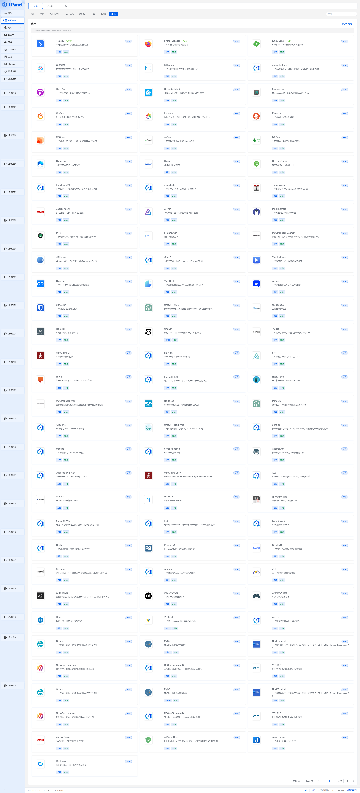

## 免责声明

### 1. 镜像容器适配
本项目仅针对原`docker`镜像容器运行进行针对`1panel`应用商店的适配。我们不对任何原始镜像的有效性做出任何明示或暗示的保证或声明，并且不对使用本仓库应用所造成的任何影响负责。用户在使用本项目时应自行承担风险。

### 2. 法律遵守
用户在使用本仓库时必须遵守所在国家与地区的法律法规。某些应用可能受到特定国家法律的限制，用户需自行了解并遵守相关法律要求。本仓库不对用户违反法律法规所产生的任何后果负责。

### 3. 免责声明接受
用户在导入本仓库并使用其中的应用时，即表示用户已经阅读、理解并同意接受本免责声明的所有条款和条件。

请注意，本免责声明仅针对本仓库的使用情况，并不包括其他第三方应用或服务。对于与本仓库链接的第三方内容，我们不对其准确性、完整性、可靠性或合法性负责。

在使用本仓库之前，请确保已经阅读、理解并接受了本免责声明的所有条款和条件。

***
## 1.简介
这是一些适配`1Panel`商店`2.0`版本的docker应用配置。


## 2.使用方式

默认`1Panel`安装在`/opt/`路径下，如果不是按需修改以下。


### 2.1
- 方式一：使用`git` 方式获取应用到`/opt/1panel/resource/apps/local`文件夹下

```shell
# 克隆名为 localApps 的分支的仓库到 /opt/1panel/resource/apps/local/appstore-localApps 目录下
git clone -b localApps https://github.com/okxlin/appstore /opt/1panel/resource/apps/local/appstore-localApps

# 将 /opt/1panel/resource/apps/local/appstore-localApps/apps 目录下的所有文件复制到 /opt/1panel/resource/apps/local/ 目录下
cp -rf /opt/1panel/resource/apps/local/appstore-localApps/apps/* /opt/1panel/resource/apps/local/

# 删除 /opt/1panel/resource/apps/local/appstore-localApps 目录及其内容
rm -r /opt/1panel/resource/apps/local/appstore-localApps
```

然后应用商店刷新本地应用即可。

将其转换为`1panel`计划任务形式则是，在计划任务框里添加以下命令

```shell
git clone -b localApps https://github.com/okxlin/appstore /opt/1panel/resource/apps/local/appstore-localApps && \
cp -rf /opt/1panel/resource/apps/local/appstore-localApps/apps/* /opt/1panel/resource/apps/local/ && \
rm -r /opt/1panel/resource/apps/local/appstore-localApps
```

###  2.2
-  方式二：使用压缩包方式获取应用到`/opt/1panel/resource/apps/local`文件夹下

```shell
# 下载localApps.zip文件到目标目录
wget -P /opt/1panel/resource/apps/local https://github.com/okxlin/appstore/archive/refs/heads/localApps.zip

# 解压缩localApps.zip文件到目标目录
unzip -o -d /opt/1panel/resource/apps/local/ /opt/1panel/resource/apps/local/localApps.zip

# 复制appstore-localApps/apps目录下的所有内容到目标目录
cp -rf /opt/1panel/resource/apps/local/appstore-localApps/apps/* /opt/1panel/resource/apps/local/

# 删除appstore-localApps目录及其内容
rm -r /opt/1panel/resource/apps/local/appstore-localApps

# 删除localApps.zip文件
rm /opt/1panel/resource/apps/local/localApps.zip
```

然后应用商店刷新本地应用即可。

将其转换为`1panel`计划任务形式则是，在计划任务框里添加以下命令

```shell
wget -P /opt/1panel/resource/apps/local https://github.com/okxlin/appstore/archive/refs/heads/localApps.zip && \
unzip -o -d /opt/1panel/resource/apps/local/ /opt/1panel/resource/apps/local/localApps.zip && \
cp -rf /opt/1panel/resource/apps/local/appstore-localApps/apps/* /opt/1panel/resource/apps/local/ && \
rm -r /opt/1panel/resource/apps/local/appstore-localApps && \
rm /opt/1panel/resource/apps/local/localApps.zip
```


## 3.备注

**未显示在本地应用列表里的，表示未完全适配应用商店面板操作**

**但是支持直接终端运行。**

以rustdesk为例

```shell
# 进入 rustdesk 的最新版本目录
cd /opt/1panel/resource/apps/local/rustdesk/versions/latest/

# 复制 .env.sample 为 .env
cp .env.sample .env

# 编辑 .env 文件，修改参数
nano .env

# 启动 RustDesk
docker-compose up -d

# 查看连接所需密钥
cat ./data/hbbs/id_ed25519.pub

```

## 4.应用一览

